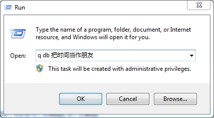
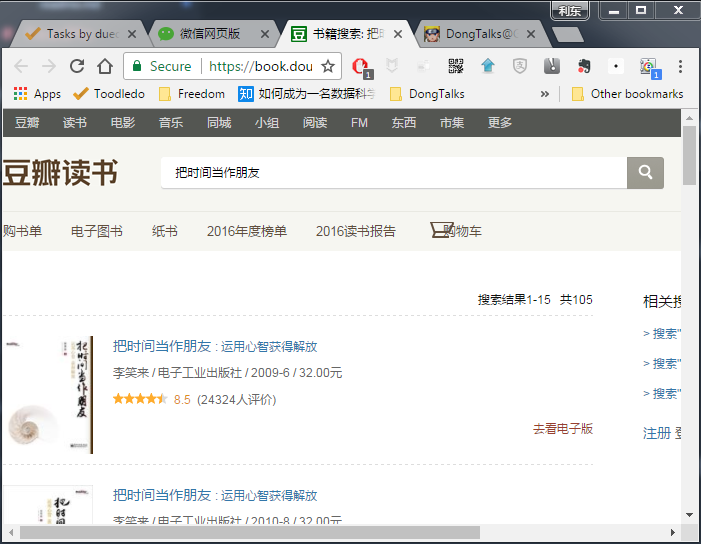

# ReadMe

Mac 上的 Alfred 用过以后就再也离不开了，现在已经成了开机启动程序。但 Windows 下始终没有一款软件可以与之抗衡，试过了好几款都不太满意。查找文件之类用 Everything 也能满足，但 Everything 做不了网络搜索，便索性自己写一个吧。那句话怎么说来着？与其抱怨，不如动手改变。

于是花了半个小时左右，用Python编了一个小脚本，创建了快捷方式放到系统Path目录下。现在最高频的是在豆瓣上搜书和查百度，便先做了这两个东西。

具体使用方法如下：

按下 `Win+R` 调用运行窗口，输入`q db keyword`，便可以调用浏览器在豆瓣上搜书，结果页面如下：

目前支持命令如下

- `db`，在豆瓣上搜书；
- `bd`，在百度上搜索；

计划下一步增加自定义功能，敬请期待。

*****

*****

